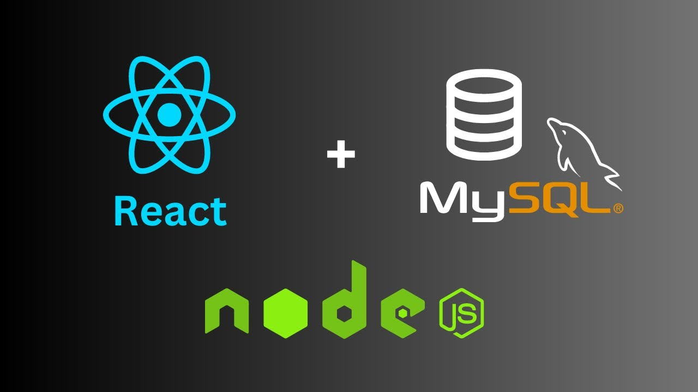
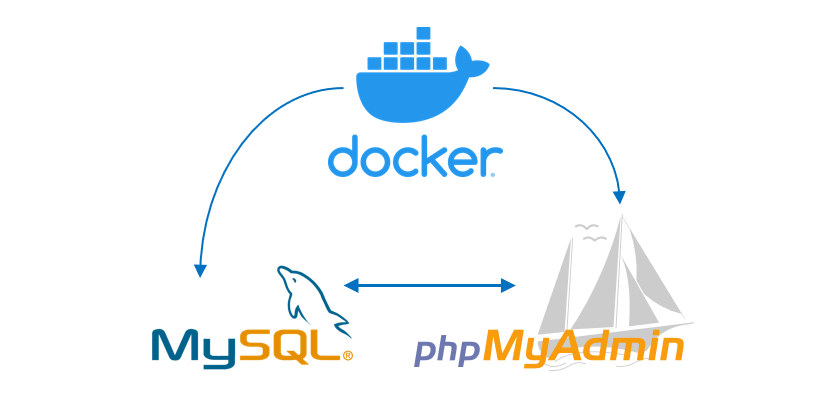

# Three-Tier MERN Application with React.js, Node.js & MySQL



## This repository contains a complete three-tier web application built using:

- `Frontend` : React.js with Vite, axios
- `Backend` : Node.js with Express, Sequelize ORM
- `Database` : MySQL (can be hosted or local)

You can deploy this app on any Linux Server , especially AWS EC2 instance , along with a MySQL database (e.g., AWS RDS).

###  If you want to run this MERN Stack app locally, you can use `Docker and Docker compose` to run Frontend, Backend, MySQL and PHPMyAdmin.

## 🐋 Prerequisite for running with Docker:
  - Just Jump to `10. Run MySQL Database Locally along with PHPMyAdmin (with docker compose file)` section of this `README` and install Docker.
  - Then cd into `run_mern_stack_with_docker_compose` folder and add you machine IP under `environment` of `frontend` on  `docker-compose.yml`
      - VITE_API_URL=http://`<Your Machine IP>`:3000
  - Then Run the `docker-compose up` command to run the whole stack.
  - Now you can access the app on your local machine at `http://localhost:5000`
  - Access Backend API at `http://localhost:3000` and PHPMyAdmin at `http://localhost:8085`.
  - You can also run the `docker-compose down` command to stop the whole stack.

## ✅ Prerequisites for running on Linux Server:
Before proceeding, ensure the following are available:

- A `Linux server` (e.g., Ubuntu on AWS EC2)
- `SSH` access to the server
- `MySQL` database (can be hosted or local with `users` database created)

`.env.example` files for both frontend and backend are present in the repo

## 🚀 Deployment Steps

### 1. Update Your System
```bash
sudo apt update && sudo apt upgrade -y
```
### 2. Install Node.js and npm


```bash
# Add the NodeSource repository for Node.js:
curl -fsSL https://deb.nodesource.com/setup_18.x | sudo -E bash -
# Replace 18.x with your desired Node.js version:
# For the latest LTS version: setup_18.x
# For the latest current version: setup_20.x

# Install Node.js:
sudo apt install -y nodejs
# Verify the installation:
node -v
npm -v
```
### 3. Install PM2
---


```bash
# Install PM2 globally:
sudo npm install pm2@latest -g
# Verify the installation:
pm2 --version
```
### 4. Clone the Repository
```bash
git clone https://github.com/mahadihassanrazib/full-stack-crud-project-with-react-node-mysql.git

# Navigate to the project directory:
cd full-stack-crud-project-with-react-node-mysql
```

### 5. Configure and Run Backend `API` Server 🏗️
```bash
# Navigate to the backend directory:
cd server

# Install dependencies:
npm install

# Create and edit the .env file:
cp .env.example .env

sudo nano .env

# Update the following environment variables according to your MySQL database configuration:
DB_HOST=
DB_USER=
DB_PASSWORD=
DB_DATABASE=

# Save and exit (`Ctrl + X`, then `Y`, then `Enter`).

# Start the backend server using PM2:
pm2 start index.js --name api-server --watch --env PORT=3000

# To view status:
pm2 status

# To view logs:
pm2 log api-server
```

### 6. Configure and Run Frontend `React` App 🌐
```bash
# Navigate to the frontend directory:
cd ../frontend

# Install dependencies:
npm install

# Create and edit the .env file:
cp .env.example .env

sudo nano .env

# Update the following variable to point to your backend API URL:
VITE_API_URL=http://your-backend-server-ip:3000

# Save and exit (`Ctrl + X`, then `Y`, then `Enter`).

# Start the frontend development server using PM2:
pm2 start npm --name "react-app" -- run dev -- --host 0.0.0.0

# To view status:
pm2 status

# To view logs:
pm2 log react-app
```

### 7. Access the Application 🔍
Once everything is running:

- Your backend API will be accessible at:
http://your-server-ip:3000
- Your frontend app will be accessible at:
http://your-server-ip:5000 (or whatever port Vite uses – check logs)

⚠️ Make sure appropriate ports (`3000`, `5000`) are open on your firewall or `AWS EC2 security group`.

### 8. Check Running Processes 🧪
```bash
pm2 list

# To stop or restart services:
pm2 stop api-server

pm2 restart react-app
```

### 9. Optional: Setup PM2 to Start on Boot 🧹
```bash
# Run this command to generate startup script:
pm2 startup
# Then follow the instruction printed in the terminal (copy & paste the provided command).

# Finally save current processes:
pm2 save
```

### 10. Run `MySQL` Database Locally along with `PHPMyAdmin` (with docker compose file) 🗄️



- Requirements:
  - Docker and Docker Compose installed on your server.
  - Docker installed on your local machine (if running locally).
- If you don't have Docker installed, follow the instructions below.

#### Install Docker and Docker Compose if not already installed:
```bash
# Install using the apt repository (Recommended): execute one by one

# Add Docker's official GPG key:
sudo apt-get update

sudo apt-get install ca-certificates curl

sudo install -m 0755 -d /etc/apt/keyrings

sudo curl -fsSL https://download.docker.com/linux/ubuntu/gpg -o /etc/apt/keyrings/docker.asc

sudo chmod a+r /etc/apt/keyrings/docker.asc

# Add the repository to Apt sources:
echo \
  "deb [arch=$(dpkg --print-architecture) signed-by=/etc/apt/keyrings/docker.asc] https://download.docker.com/linux/ubuntu \
  $(. /etc/os-release && echo "${UBUNTU_CODENAME:-$VERSION_CODENAME}") stable" | \
  sudo tee /etc/apt/sources.list.d/docker.list > /dev/null

sudo apt-get update
```

#### Install Docker Engine, containerd, and Docker Compose:
```bash

sudo apt-get install docker-ce docker-ce-cli containerd.io docker-buildx-plugin docker-compose-plugin -y

```

#### Linux post-installation steps for Docker Engine
```bash
# Create the docker group.
sudo groupadd docker

# Add your user to the docker group.
sudo usermod -aG docker $USER

# run the following command to activate the changes to groups:
newgrp docker

# Verify that you can run docker commands without sudo.
docker run hello-world
```

##### Create a Docker Compose file for MySQL:
- Create a file named `docker-compose.yml` in your project directory with the following content:

```yaml
version: '3.8'

services:
  mysql:
    image: mysql:8.0      # Use the official MySQL 8.0 image
    container_name: mysql_container
    restart: always
    environment:
      MYSQL_ROOT_PASSWORD: rootpassword               # Root user's password (change for production)
      MYSQL_DATABASE: crud_operations                     # Database name
      MYSQL_USER: myuser                           # Regular user
      MYSQL_PASSWORD: mypassword                    # Password for `MYSQL_USER`
    ports:
      - "3306:3306"                                   # Expose MySQL on port 3306
    volumes:
      - db_data:/var/lib/mysql                        # Persist data in a Docker volume
    networks:
      - todo_network

  phpmyadmin:
    image: phpmyadmin/phpmyadmin:latest                 # Use the latest phpMyAdmin image
    container_name: phpmyadmin_container                # Name the phpMyAdmin container
    restart: always                                     # Restart the container automatically if it crashes
    environment:
      PMA_HOST: mysql                                   # Hostname of the MySQL server (matches the `mysql` service)
      PMA_USER: root                                    # MySQL root user for phpMyAdmin
      PMA_PASSWORD: rootpassword                       # Password for the MySQL root user
    ports:
      - "8085:80"                                       # Expose phpMyAdmin on port 8085
    depends_on:
      - mysql                                           # Ensure that the MySQL container starts before phpMyAdmin
    networks:
      - todo_network

volumes:                                              # Define volume for data persistence
  db_data:

networks:                                             # Define custom network
  todo_network:

```

#### Start the MySQL container:
```bash
# Navigate to the directory where your docker-compose.yml file is located:
cd z-mysql-with-docker-compose/

# Start the MySQL container using Docker Compose:
docker-compose up -d
# The -d flag runs the container in detached mode (in the background).
# To check the status of the container, run:
docker ps
# To stop the container, run:
docker-compose down
# To remove the container and its associated volumes, run:
docker-compose down -v

```
#### Explore MySQL Server with PHPMyAdmin:
- Open your web browser and navigate to `http://your-server-ip:8085` to access phpMyAdmin.


- `Now you can use the MySQL with you Node Application:`

---


### 11. RDS connectivity 📦

- Ensure your `MySQL database is accessible` from your EC2 instance (especially if using AWS RDS).

### Mysql Client Install :
  ```bash
  sudo apt update
  sudo apt install mysql-client -y

### Connect to RDS
  mysql -h <RDS endpint>  -u <dbusername> -p

 ✅ Basic MySQL Verification Commands✅
## Show current user
  SELECT USER(), CURRENT_USER();

## List all databases
  SHOW DATABASES;
  
## Use a specific database
  USE your_database_name;
  
## List all tables in the selected database
  SHOW TABLES;

## Check RDS version and info
  SELECT VERSION();
  SELECT @@hostname, @@port, @@version_comment;
  
## To see the data in a users table, you'll typically use an SQL query 
  SELECT * FROM users;

## To edit the data in your users table in MySQL, you can use the UPDATE statement.
For example, if you want to update the name or email for the user with id = 1, use this:

 UPDATE users
 SET name = 'Amir H.', email = 'amir.h@example.com'
 WHERE id = 1;


### 11. Additional Notes 📦
- You can use `Nginx` as a reverse proxy for production deployment.
- For better performance, build the frontend for production:
```bash
npm run build
# one dist folder will be created in frontend directory
```


# Contributing 🤝
### Feel free to contribute or report issues to improve this setup guide!

## License 📄
MIT License – see `LICENSE` for details.

### Let me know if you'd like a version of this README with commands for setting up Nginx, domain SSL, or Docker support.

## Happy Coding! 🎉
### Original Author: [Mahadi Hassan Razib]
### Reviewed & RDS part updated by: [Amir Hossain]
#### Project Credit: [`Mushfiqur Rahman`] (https://github.com/nia3zzz)
